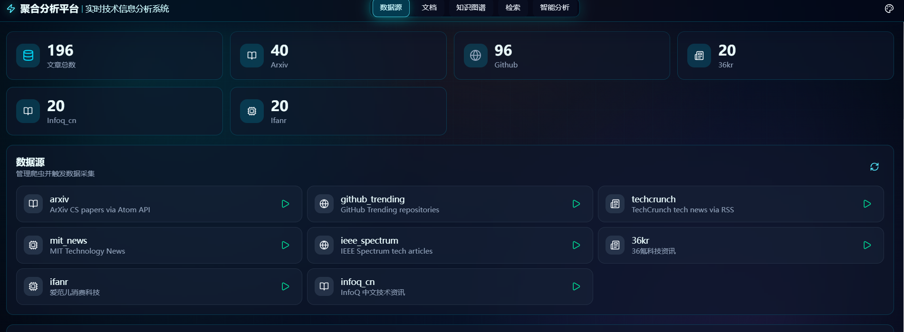
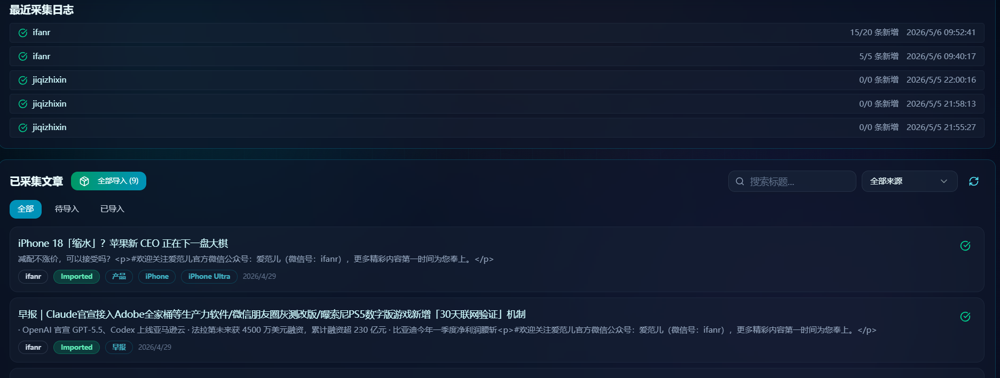
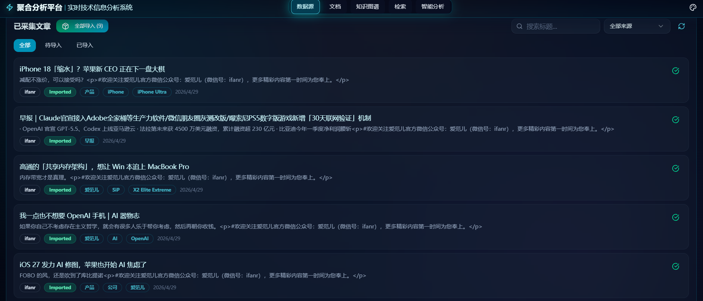
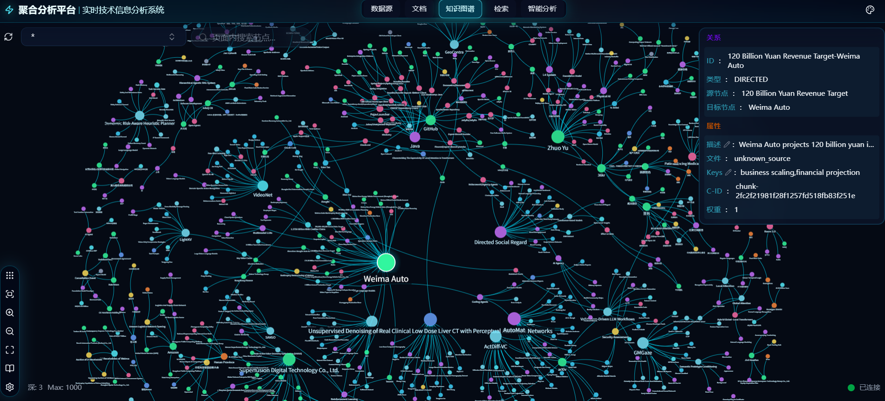
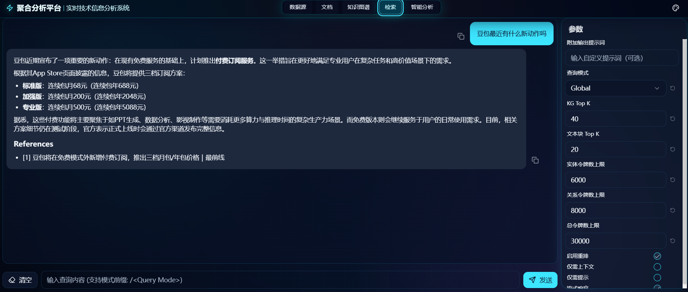
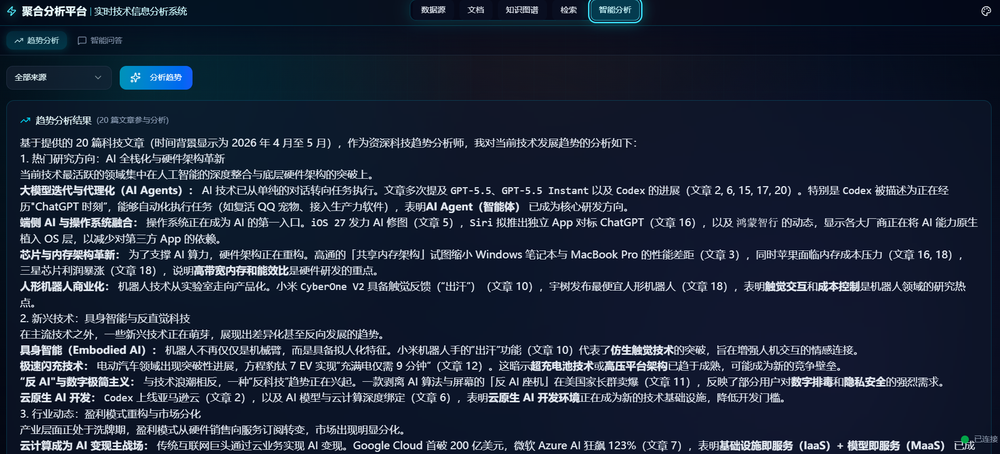

# 🚀 实时技术信息检索与智能分析系统（LightRAG + 爬虫 + 知识图谱）

> 一个面向科技信息场景的“采集 → 入库 → 图谱构建 → 智能分析 → 可视化问答”一体化系统。  
> 支持中英文技术资讯，支持知识图谱检索与趋势分析。
---

## 📌 项目亮点

- 🕸️ **多源数据采集**：支持 ArXiv、GitHub Trending、TechCrunch、36kr、爱范儿、InfoQ 中文等。
- 🧠 **自动知识抽取**：基于 LLM 自动提取实体与关系，构建知识图谱。
- 🧭 **智能问答与趋势分析**：支持基于采集文章上下文进行问答与趋势洞察。
- 🌏 **中英文兼容**：中文来源可提取中文节点，英文来源保留英文节点。
- 🧩 **模块解耦清晰**：前端、平台后端、LightRAG 核心后端职责明确。

---

## 🏗️ 系统架构总览

## 1) 前端层（Web UI）

**技术栈**：React 19 + TypeScript + Vite + Tailwind + Bun

主要页面/窗口：

- 📦 **数据源窗口**：一键采集、文章列表、状态筛选（待导入/已导入）
- 🧠 **智能分析窗口**：趋势分析、上下文问答（调用 `/api/analysis/*`）
- 🕸️ **知识图谱窗口**：图谱可视化、图谱检索、实体关系浏览
- 🔎 **检索与问答窗口**：RAG 查询与答案输出

前端关键目录：

- `lightrag_webui/src/features/`：各功能页面
- `lightrag_webui/src/api/platform.ts`：调用平台后端 API

---

## 2) 平台后端（业务编排层）

**技术栈**：FastAPI（`server.py` 启动）

职责：

- 🕷️ 管理爬虫任务：触发采集、任务状态、日志
- 📰 管理文章数据：分页、筛选、详情、状态
- 🤖 提供智能分析 API：摘要、趋势分析、上下文问答
- 🔌 对接 LightRAG API：将文章导入知识图谱主服务

关键模块：

- `crawler/api.py`：爬虫管理 + 文章管理 + 批量导入
- `algorithm/analysis.py`：智能分析（Qwen API 调用）

---

## 3) 知识图谱/RAG 核心层（LightRAG）

**技术栈**：LightRAG（FastAPI + 图谱存储 + 向量检索）

职责：

- 📄 文档切分与向量化
- 🧩 实体关系抽取与图谱构建
- 🗂️ KV/向量/图存储管理
- 🧠 Query 模式检索（local/global/hybrid/mix/naive）

关键目录：

- `lightrag/`：LightRAG 核心代码
- `lightrag/api/`：LightRAG API 服务

---

## 4) 数据流（从采集到回答）

```text
数据源爬虫
   ↓
data/articles + index.json
   ↓（导入）
LightRAG /documents/text
   ↓
实体/关系抽取 + 向量化
   ↓
知识图谱 + 向量库
   ↓
图谱查询 / 问答 / 智能分析
```

---

## 🧰 使用到的核心工具与服务

- **前端**：React、TypeScript、Vite、Tailwind、Bun
- **后端**：FastAPI、Pydantic
- **爬虫**：Scrapy
- **LLM/Embedding**：DashScope OpenAI-Compatible（Qwen / Embedding）
- **RAG引擎**：LightRAG
- **默认存储**：JsonKV + NetworkX + NanoVectorDB（本地轻量部署）

---

## ⚙️ 配置说明

当前 `.env` 中主要使用两套模型入口：

1. 🕸️ **知识图谱主链路（LightRAG）**
   - `LLM_BINDING_*` + `LLM_MODEL`
   - 用于实体关系抽取、图谱构建、RAG 问答

2. 🧠 **智能分析窗口**
   - `QWEN_*`
   - 用于趋势分析、智能问答、摘要生成（`/api/analysis/*`）

3. 🧷 **向量化模型**
   - `EMBEDDING_BINDING_*` + `EMBEDDING_MODEL`
   - 用于文本、实体、关系向量化检索

---

## 💻 本地部署

> 下面是“从零到跑通”的一套流程。

## 0. 前置条件

- Windows 10/11
- Python 3.10+
- Bun（用于前端构建）
- 网络可访问 DashScope

---

## 1. 安装依赖（后端 + 爬虫）

在项目根目录执行：

```bash
# 进入项目
cd d:\General_real-time_tech_info_search_and_smart_analysis_system

# 若已有 .venv，先激活
.venv\Scripts\activate

# 确保 pip 可用
python -m ensurepip --upgrade
python -m pip install --upgrade pip setuptools wheel

# 安装项目运行关键依赖
python -m pip install scrapy fake-useragent fastapi uvicorn httpx
```

> 说明：`scrapy` 和 `fake-useragent` 是爬虫能否运行的关键依赖。

---

## 2. 配置 `.env`

### A) LightRAG 主链路

```env
LLM_BINDING=openai
LLM_BINDING_HOST=https://dashscope.aliyuncs.com/compatible-mode/v1
LLM_BINDING_API_KEY=your-key
LLM_MODEL=qwen3-max
```

### B) 智能分析窗口

```env
QWEN_BASE_URL=https://dashscope.aliyuncs.com/compatible-mode/v1
QWEN_API_KEY=yourkey
QWEN_MODEL=qwen3.5-plus
QWEN_TIMEOUT=120
```

### C) Embedding

```env
EMBEDDING_BINDING=openai
EMBEDDING_BINDING_HOST=https://dashscope.aliyuncs.com/compatible-mode/v1
EMBEDDING_BINDING_API_KEY=yourkey
EMBEDDING_MODEL=text-embedding-v4
EMBEDDING_DIM=1024
```

---

## 3. 构建前端

```bash
cd lightrag_webui
bun install --frozen-lockfile
bun run build
cd ..
```

---

## 4. 启动服务（两个都要启动）

### 4.1 启动 LightRAG 主服务（9622）

```bash
lightrag-server
# 或
uvicorn lightrag.api.lightrag_server:app --host 0.0.0.0 --port 9622 --reload
```

### 4.2 启动平台后端（8000）

```bash
python server.py
```

---

## 5. 打开系统

浏览器访问：

- 平台入口：`http://localhost:8000`
- LightRAG API：`http://localhost:9622/docs`

---

## 🧪 首次使用（建议顺序）

1. 📡 在“数据源窗口”点击采集（推荐先 `36kr / ifanr / infoq_cn`）
2. 📥 在“已采集文章”里执行导入（单篇或全部导入）
3. 🕸️ 打开“知识图谱窗口”查看节点关系
4. 🧠 打开“智能分析窗口”做趋势分析和问答

---

## 🛠️ 常见问题与排查

## 1) 采集按钮点了但 0 条

先看平台日志是否有：

- `POST /api/crawler/crawl`（是否触发）
- `Spider failed ...`（是否报错）

常见原因：

- 缺依赖：`No module named scrapy` / `fake_useragent`
- 目标站点 RSS 失效或页面结构变更

---

## 2) 智能分析提示 API 未配置

检查 `.env` 是否有：

- `QWEN_API_KEY`
- `QWEN_BASE_URL`
- `QWEN_MODEL`

并重启 `python server.py`。


## 4) 前端改了不生效

```bash
cd lightrag_webui
bun run build
```

然后刷新浏览器（必要时清缓存）。

---

## 📁 关键目录速览

```text
.
├─ crawler/
│  ├─ api.py                         # 爬虫任务管理与文章导入API
│  └─ scrapy_project/tech_spider/
│     └─ spiders/                    # 各数据源爬虫
├─ algorithm/
│  └─ analysis.py                    # 智能分析（Qwen API）
├─ lightrag/                         # LightRAG 核心
├─ lightrag_webui/                   # 前端
├─ data/
│  ├─ articles/                      # 采集后的文章
│  └─ logs/                          # 采集日志
└─ .env                              # 核心配置
```

---

## 🧭 后续可优化方向

- ✅ 新增更多稳定中文源（雷锋网、虎嗅等）
- ✅ 增加采集失败重试策略与告警提示
- ✅ 引入 Playwright 处理重 JS 渲染站点
- ✅ 增加图谱版本管理（按批次回滚）
- ✅ 增加成本监控（LLM/Embedding token 统计）

---

## 🎬 视频 Demo 展示

> 如果你将演示视频放到仓库内的 `docs/videos/demo_show.mp4`，下面的播放器即可在支持 HTML 的 Markdown 渲染环境中直接展示。

<video controls width="100%" src="docs/videos/demo_show.mp4"></video>

---

## 🖼️ 系统界面展示（实机截图）

### 1) 数据源总览与采集入口



- 展示了系统统计卡片（文章总数、各来源计数）
- 支持一键触发多数据源采集
- 当前中文源已切换为：`36kr`、`ifanr`、`infoq_cn`

### 2) 最近采集日志 + 已采集文章（导入状态）



- 可查看最近采集任务是否成功
- 文章列表支持状态区分：`待导入` / `已导入`
- 支持“全部导入”批处理

### 3) 已采集文章列表（分页/标签/状态）



- 展示来源标签、主题标签、发布时间
- 右侧状态图标便于快速识别处理结果

### 4) 知识图谱可视化



- 节点/边网络结构清晰展示实体关系
- 支持点击节点查看实体详情、关系关键词、来源 chunk

### 5) 检索与问答窗口（RAG 参数可调）



- 支持 Query 模式切换（如 Global / Hybrid 等）
- 可调参数：Top K、上下文 token 上限等

### 6) 智能分析窗口（趋势分析）



- 基于已采集文章生成趋势洞察
- 输出包含热点方向、新兴趋势、产业判断等结构化分析


```text
docs/images/01-data-source-overview.jpg
docs/images/02-crawl-logs-and-articles.jpg
docs/images/03-article-list.jpg
docs/images/04-knowledge-graph.jpg
docs/images/05-query-and-qa.jpg
docs/images/06-smart-analysis-trends.jpg
```

---

## ✅ 当前状态

系统当前已经具备：

- 多源采集 ✅
- 文章导入 LightRAG ✅
- 图谱构建与检索 ✅
- 智能分析（qwen3.5-plus）✅
- 中英知识内容混合展示 ✅

